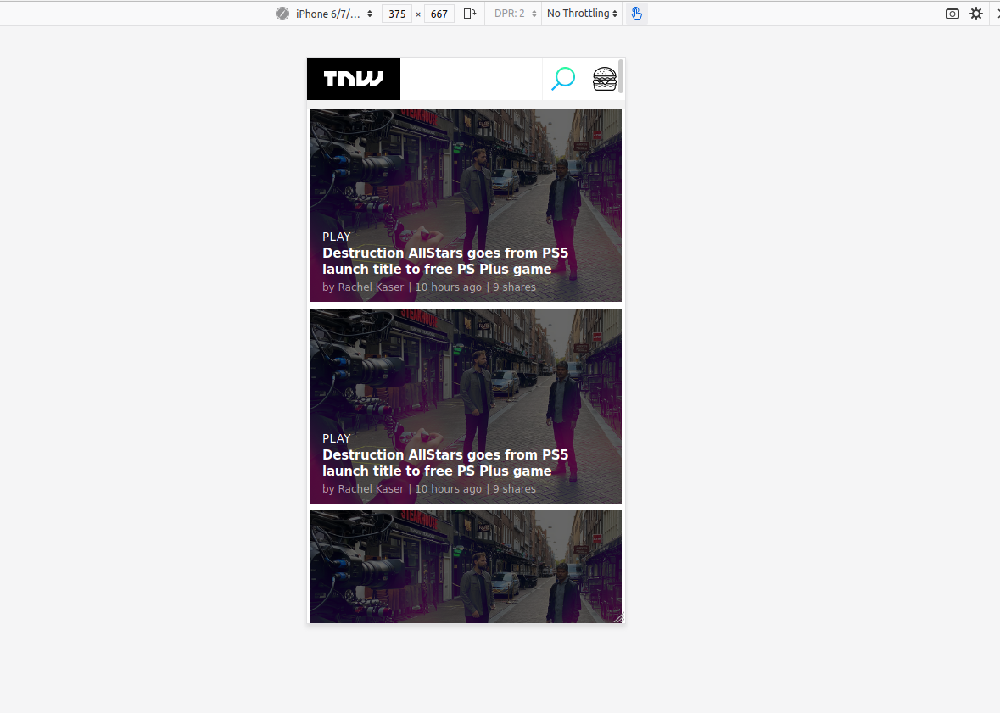

# TNW

Cloning the TNW Homepage using different positioning methods. 

    This is a project that clones the TNW Home Page. The purpose of this project is to practice positioning and gradient.

Remake of home page from The Next Web(TNW.com).

Built With

    Html,
    CSS,
    Linter,
    VS Code

Live Demo

Live Demo Link

Automated Test

    There are no automated tests for this project yet.

Authors

bust_in_silhouette Author1

    Github: @akshay-narkar
    Twitter:@akidoit

bust_in_silhouette Author2

    Github: @kunmi02
    Twitter: @akinkunmi006

handshake Contributing

Contributions, issues and feature requests are welcome! Start by:

    Forking the project
    Cloning the project to your local machine
    cd into the project directory
    Run git checkout -b your-branch-name
    Make your contributions
    Push your branch up to your forked repository
    Open a Pull Request with a detailed description to the development branch of the original project for a review

Show your support

Give a star if you like this project!
memo License

This project is MIT licensed
